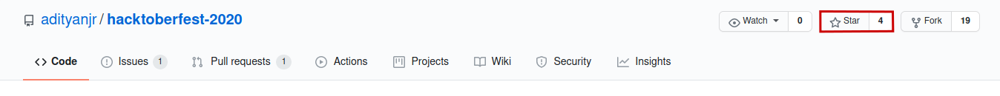

<h1 align="center"> Hacktoberfest-2020</h1>


<p align="center">
   
    
   
   
   
   
</p>

**Register [here](https://hacktoberfest.digitalocean.com) for Hacktoberfest-2020 and make 4 pull requests (PRs) between October 1-31 to earn a free T-shirt:tshirt: and Stickers.**

***

### What is Hacktoberfest?

Hacktoberfest is the easiest way to get into open source! Hacktoberfest is a month long festival of open source code presented by [Digital Ocean](https://www.digitalocean.com/), [Intel](https://hacktoberfest.digitalocean.com/intel.pdf) and [DEV](https://www.dev.to/) this year in 2020.

During the entire month of October 2020, all you have to do is contribute to any open source projects and open at least 4 pull requests. Yes, any project and any kind of contributions. It can be a bug fix, improvement, or even a documentation change! And win a T-Shirt:tshirt: and awesome stickers.

If you’ve never contributed to open source before, this is the perfect time to get started because Hacktoberfest provides a large list of available contribution opportunities (and yes, there are always plenty for beginners too).

### Why Should I Contribute?
Hacktoberfest has a simple and plain moto.
> Support open source and earn a limited edition T-shirt and few stickers!

So, yes! You can win a T-Shirt:tshirt: and few awesome stickers to attach on your laptop. On plus side, you will get into beautiful world of open source and get the international exposure. 


### What is a pull request?
- Pull requests are proposed code changes you can submit to a branch in a repository on GitHub. Once submitted, a project maintainer will review and discuss the changes before they become final.

- New to Open Source? Don't know how to [`Create a Pull Request`](https://www.digitalocean.com/community/tutorials/how-to-create-a-pull-request-on-github)? read this documentation.

***

## How do I get started?


- If you don't have git on your machine, [install it]( https://help.github.com/articles/set-up-git/).

### Fork this repository

Fork this repository by clicking on the fork button on the top of this page.
This will create a copy of this repository in your account.

### Clone the repository

Now clone the forked repository to your machine. Go to your GitHub account, open the forked repository, click on the clone button and then click the *copy to clipboard* icon :clipboard:.

Open a terminal and run the following git command:

```
git clone "url you just copied"
```
where "url-you-just-copied" (without the quotation marks) is the url to this repository (your fork of this project). See the previous steps to obtain the url.


For example:
```
git clone https://github.com/this-is-you/first-contributions.git
```
where `this-is-you` is your GitHub username. Here you're copying the contents of the first-contributions repository on GitHub to your computer.

### Create a branch

Change to the repository directory on your computer (if you are not already there):

```
cd first-contributions
```
Now create a branch using the `git checkout` command:
```
git checkout -b <add-your-new-branch-name>
```

For example:
```
git checkout -b add-alonzo-church
```
(The name of the branch does not need to have the word *add* in it, but it's a reasonable thing to include because the purpose of this branch is to add your name to a list.)

#### Make necessary changes and commit those changes

Now open `Contributors.md` file in a text editor, add your name to it, with your Github profile link. Now, save the file.


If you go to the project directory and execute the command `git status`, you'll see there are changes.


Add those changes to the branch you just created using the `git add` command:

```
git add Contributors.md
```

Now commit those changes using the `git commit` command:
```
git commit -m "Add <your-name> to Contributors list"
```
replacing `<your-name>` with your name.

### Push changes to GitHub

Push your changes using the command `git push`:
```
git push origin <add-your-branch-name>
```
replacing `<add-your-branch-name>` with the name of the branch you created earlier.

### Submit your changes for review

- If you go to your repository on GitHub, you'll see a  `Compare & pull request` button. Click on that button.


- To submit the Pull Request(PR) write a `Title`, `Leave a message` and press `Create pull request` button.


#### And That's All.You did it. :partying_face: 	:clap:
   - Soon I'll be merging all your changes into the master branch of this project. Starting Now !

If you find the repo the useful, feel free to Star :star: the repo.



***

## How to Update

In the case when you kept the original repository git history, you have to update your repo from remote to avoid conflict and update your repo with others work. 
You can always pull and merge updates from the "upstream" repository back into your
project by running:

```bash
$ git fetch upstream            # Fetch (upstream) repository
$ git checkout main             # Switch to the main branch (or, master branch)
$ git merge upstream/main       # Merge upstream/master into the local branch
```
**Or**
```bash
$ git checkout main             # Switch to the main branch (or, master branch)
$ git pull origin main          # Fetch and Merge upstream/master into the local branch
```
***

### Made with :heart: by <a href="https://github.com/adityanjr">adityanjr</a>

[](https://github.com/adityanjr)
